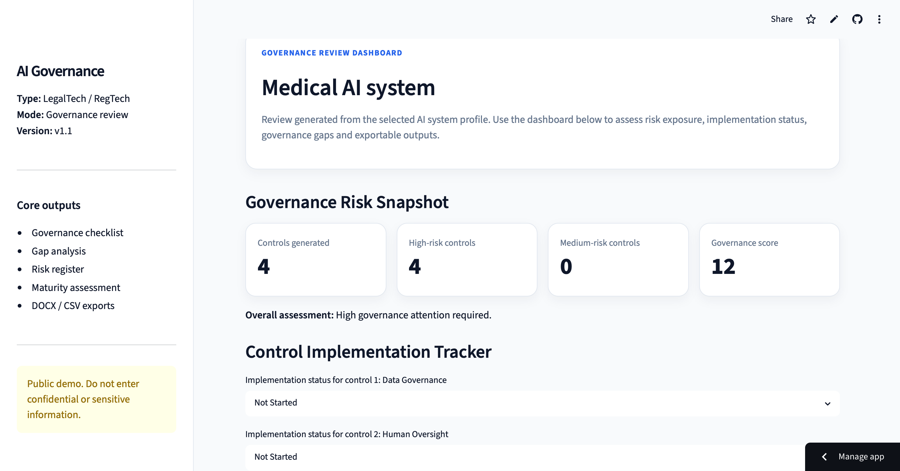

# AI Governance Checklist Generator

AI Governance Checklist Generator is a Streamlit-based LegalTech / RegTech prototype designed to help legal, compliance, product and R&D teams generate operational AI governance checklists for different types of AI systems.

The project translates AI governance concerns into practical control requirements, implementation tracking, maturity assessment, governance gap analysis and exportable reports.

## Live Demo

You can access the public demo here:

https://ai-governance-checklist-generator-w5m7gussinnbsetec5ddy7.streamlit.app/

## Screenshot



## Project Overview

This tool supports early-stage AI governance reviews by generating structured governance outputs based on the type of AI system being assessed.

It is designed for use cases such as:

- internal AI governance review
- product and R&D risk assessment
- legal/compliance pre-deployment checks
- AI system documentation
- governance maturity assessment
- AI risk register preparation

The tool is rule-based and does not provide legal advice or automated regulatory certification.

## Key Features

- AI system type selection
- AI system metadata form
- Governance checklist generation
- Risk level and priority mapping
- Control owner mapping
- Implementation status tracking
- Governance completion rate
- Governance maturity assessment
- Recommended action plan
- Governance gap analysis
- AI governance risk register
- Risk-based filtering by risk level, priority, owner and implementation status
- Markdown report export
- DOCX report export
- CSV export for the risk register
- Public demo disclaimer and confidentiality warning

## Supported AI System Types

The prototype currently supports governance checklist generation for:

- Internal productivity AI tool
- Medical AI system
- HR / recruitment AI system
- Customer-facing chatbot
- Automated decision system
- Data analytics / prediction system

## Governance Dimensions Covered

The checklist logic covers governance dimensions such as:

- Data governance
- Human oversight
- Documentation
- Transparency
- Confidentiality
- Bias and fairness
- Monitoring
- Accountability
- Content safety
- Business use limitation

## Outputs Generated

The application can generate:

1. **Governance checklist**

   A structured list of recommended controls for the selected AI system type.

2. **Implementation progress overview**

   A summary of controls marked as Not Started, In Progress, Implemented or Not Applicable.

3. **Governance maturity assessment**

   A maturity level based on the implementation completion rate.

4. **Governance gap analysis**

   Identification of critical governance gaps, immediate action items and remediation needs.

5. **AI governance risk register**

   A structured risk register with risk IDs, categories, owners, statuses, gaps and recommended controls.

6. **Executive report**

   Exportable Markdown and DOCX reports including executive summary, metadata, controls, risk register, gap analysis and action plan.

7. **CSV risk register**

   A CSV file for use in Excel, Google Sheets, Notion, Airtable, GRC tools or internal compliance trackers.

## Tech Stack

- Python
- Streamlit
- Pandas
- python-docx
- Markdown
- Git / GitHub

## Project Structure

```text
03_ai_governance_checklist_generator/
├── app.py
├── governance_data.py
├── checklist_engine.py
├── report_generator.py
├── export.py
├── requirements.txt
├── README.md
└── Outputs/
```

## How to Run Locally

Clone the repository:

```bash
git clone YOUR_REPOSITORY_URL
cd 03_ai_governance_checklist_generator
```

Create and activate a virtual environment:

```bash
python3 -m venv .venv
source .venv/bin/activate
```

Install dependencies:

```bash
python -m pip install -r requirements.txt
```

Run the app:

```bash
python -m streamlit run app.py
```

## Example Use Case

A legal or compliance team wants to review a medical AI prototype before internal testing.

The user selects:

```text
Medical AI system
```

The tool generates:

- high-risk governance controls
- required owners
- implementation status tracking
- critical governance gaps
- maturity level
- recommended action plan
- downloadable DOCX report
- downloadable CSV risk register

## Strategic Purpose

This project demonstrates the ability to combine:

- legal and regulatory reasoning
- AI governance concepts
- operational compliance workflows
- structured risk analysis
- business-oriented reporting
- Python-based automation
- Streamlit product prototyping

It is intended as a portfolio project at the intersection of law, AI governance, LegalTech and technology business.

## Roadmap

Planned future improvements include:

- improved Streamlit UI design
- richer control library
- sector-specific AI governance modules
- EU AI Act and international AI governance mapping
- evidence upload and document review
- control implementation evidence tracking
- user-defined custom controls
- dashboard charts
- PDF export
- persistent storage
- authentication for private deployment

## Disclaimer

This project is a prototype for educational and portfolio purposes only.

It does not provide legal advice, regulatory advice or compliance certification. Users should not input confidential, personal, sensitive or proprietary information into any public demo version of this tool.

Legal, regulatory and business decisions should be reviewed by qualified professionals.